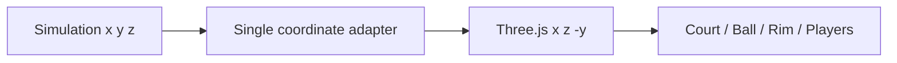
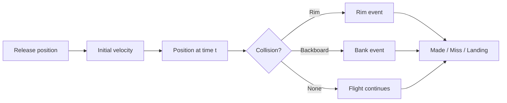
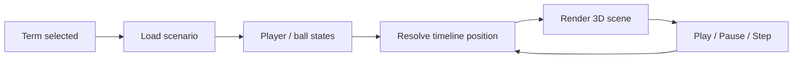

<div align="center">

# 🏀 Basketball Playbook Lab

### Learn basketball by watching the game move.

농구 용어·플레이·슛을 **실제 코트 좌표 위의 3D 장면**으로 이해하는 인터랙티브 학습 프로젝트입니다.

<p>
  
  
  
  
</p>

**74 basketball terms · shot physics · play timelines · quizzes**

[Overview](#overview) · [Simulation](#simulation) · [Architecture](#architecture) · [Run](#run)

</div>

---

## Overview

농구 용어를 글로만 외우면 실제 코트에서 어떻게 움직이는지 잘 남지 않았습니다. 그래서 하프코트를 3D로 만들고, 슛과 플레이를 **같은 좌표계에서 직접 움직이게** 만들었습니다.

| What you can explore | How it works |
|---|---|
| 🏀 Shot outcomes | Swish, rim, bank, airball을 서로 다른 이벤트로 계산 |
| 🧭 Court geometry | NBA 하프코트 규격을 미터 좌표계로 표현 |
| 🎬 Play timeline | 용어마다 별도 scenario와 단계별 움직임 재생 |
| 🔎 Basketball dictionary | 한글·영문 검색과 7개 분류 |
| 🎥 Multiple cameras | Coach / Top / Rim view |
| 🧠 Practice | 퀴즈와 브라우저 진도 저장 |

## Simulation

### Coordinate system

계산에서는 일반적인 `(x, y, z)`를 쓰고 Three.js에 넘길 때만 좌표계를 변환합니다.



이 변환을 한 곳에만 두어 오브젝트마다 기준축이 달라지는 문제를 막습니다.

| Court constant | Value |
|---|---:|
| Half court | `15.24 m × 14.3256 m` |
| Rim height | `3.048 m` |
| 3PT arc radius | `7.239 m` |
| Corner 3 line | `x = ±6.7056 m` |

### Shot trajectory

기본 비행은 중력가속도 `9.81 m/s²`를 적용한 포물선 운동으로 계산합니다.



결과 이름만 바꾸는 방식이 아니라 **접촉 이벤트 자체가 다릅니다.**

| Result | Event flow |
|---|---|
| **Swish** | release → rim crossing → made |
| **Airball** | release → miss → landing, no contact |
| **Front / Back rim** | release → rim contact → miss |
| **Rim out** | release → rim contact → outside rebound |
| **Bank make** | release → backboard → rim crossing → made |

### Play timeline



각 용어는 하나의 공통 애니메이션을 돌려 쓰지 않고 자기 scenario를 가집니다.

## Architecture

```text
src/
├── data/       terms, quizzes, scenarios
├── features/   search, playback, explanation, progress
├── hooks/      accessibility preferences
├── scene/      Three.js court, players, ball, cameras
├── sim/        dimensions, trajectory, collision, timeline
└── test/       simulation tests
```

`sim/`은 React와 Three.js에 직접 의존하지 않게 분리했습니다. 덕분에 화면을 띄우지 않고도 코트 규격, 충돌, 슛 결과와 timeline을 테스트할 수 있습니다.

## Run

Node.js 22 기준입니다.

```bash
npm ci
npm run dev
```

검증:

```bash
npm test -- --run
npm run typecheck
npm run build
```

## Where this repo fits

> **Basketball Playbook Lab = 농구 개념과 플레이를 3D 장면으로 배우는 시뮬레이터**

| Repository | Role |
|---|---|
| `shooting-profile-coach-ios` | FormPath 슈팅 분석 제품 |
| `shooting-form-analysis` | 영상 pose / DTW 분석 실험 |
| `rudwpahs-basketball` | 개인 프로필과 훈련 기록 |
| **`Basketball`** | 플레이·규칙·슛을 3D로 학습 |

## References

- NBA 2025–26 Official Playing Rules
- NBA Rule No. 1 — Court Dimensions & Equipment
- *Using In-Game Shot Trajectories to Better Understand Defensive Impact in the NBA*
- *Kinematic Analysis of Basketball Shooting*
- *Optimal Release Conditions for the Free Throw in Men’s Basketball*

세부 조사 메모는 `docs/research/2026-07-26-basketball-simulator-research.md`, 설계 결정은 `docs/superpowers/specs/2026-07-26-basketball-playbook-lab-design.md`에 있습니다.
